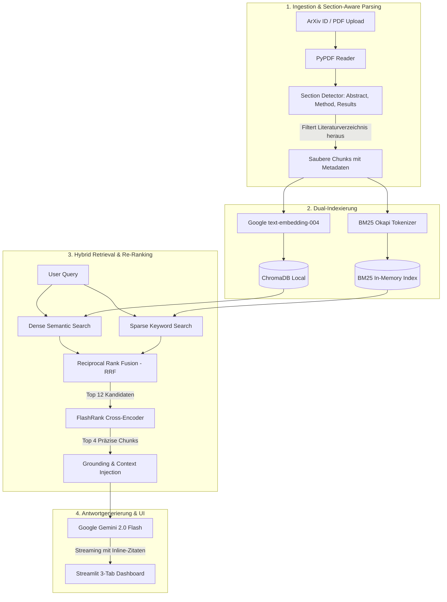

# 🔬 ArXivLens: Academic Research Studio & Paper Synthesis RAG

[](https://www.python.org/)
[](LICENSE)
[](https://streamlit.io/)
[-8E75B2.svg)](https://aistudio.google.com/)
[](https://www.trychroma.com/)
[-green.svg)](https://github.com/PrithivirajDamodaran/FlashRank)


> **Ein praxisnahes, kostenloses RAG-System für wissenschaftliche Arbeiten, das reale Probleme wie zerschnittene Tabellen, Formelverluste und ungenaue Zitate durch hybride Suche und Cross-Encoder Re-Ranking löst.**

---

## 💡 Warum dieses Projekt existiert (Das Problem mit Standard-RAG)

Fast jedes RAG-Tutorial im Internet nutzt dasselbe naive Rezept:
`PDF laden → 500 Zeichen Splitter → Embeddings → Cosine Similarity → Prompt`.

Wer das jemals mit einem echten ArXiv-Paper (wie *„Attention Is All You Need“*) ausprobiert hat, weiß, wie schnell das scheitert:
1. **Zerschnittene Tabellen & Formeln:** Ein starrer Zeichen-Splitter schneidet mathematische Gleichungen oder Benchmark-Ergebnisse mitten im Satz ab.
2. **Bibliografie-Müll:** Bis zu 30 % des Vektorspeichers wird durch Literaturverzeichnisse (`References`) verschwendet. Fragt man nach Autoren, zitiert das System frühere Quellen statt die tatsächliche Studie.
3. **Begriffsblindheit von Embeddings:** Reines Cosine-Similarity-Matching versagt häufig bei spezifischen Bezeichnungen (z.B. *„BLEU-4 Score“*, *„LoRA r=16“* oder *„Table 3“*), weil solche Begriffe im semantischen Vektorraum untergehen.

**ArXivLens wurde gebaut, um genau diese Schwachstellen mit modernen Information-Retrieval-Techniken systematisch zu beheben.**

---

## 🏗️ Architektur & Pipeline



---

## ⚡ Die Kern-Features im Überblick

### 1. Section-Aware Markdown Parsing
Statt blind nach Zeichenanzahl zu schneiden, erkennt der Parser typische wissenschaftliche Abschnitte (*Abstract, Model Architecture, Experiments, Discussion*). Sobald die *References* beginnen, stoppt die Indizierung – das hält den Index sauber und spart Token.

### 2. Hybrid Search (Dense + BM25 via Reciprocal Rank Fusion)
- **Dense Embeddings (Google text-embedding-004):** Findet konzeptionelle Zusammenhänge (*„Wie skaliert der Attention-Mechanismus mit der Sequenzlänge?“*).
- **Sparse BM25 Search:** Fängt exakte Begriffe, Tabellenbezeichnungen und Metriken ab (*„BLEU Score WMT 2014“*).
- **RRF:** Kombiniert beide Ranglisten über die Formel:
  $$\text{RRF\_Score}(d) = \sum_{m \in \{\text{dense}, \text{bm25}\}} \frac{1}{k + \text{rank}_m(d)}$$

### 3. FlashRank Re-Ranking (Lokaler Cross-Encoder)
Anstatt alle Chunks ungefiltert an das LLM zu schicken, analysiert FlashRank (Cross-Encoder auf CPU) jedes Query-Chunk-Paar gemeinsam. Im UI gibt es einen Live-Schalter, mit dem Tester den Effekt *(„Mit vs. Ohne Re-Ranking“)* direkt nachvollziehen können.

### 4. 0,00 € Betriebskosten & BYOK-Modell
- Läuft vollständig über den dauerhaft kostenlosen **Google Gemini Free Tier** (keine Kreditkarte erforderlich).
- **Dual-Input:** Für Entwickler direkt via `.env`, für fremde Tester über ein Passwort-Feld in der Streamlit-Sidebar.

---

## 🖥️ Das Streamlit Web-Dashboard

Das Frontend wurde mit einem maßgeschneiderten **Modern Dark/Slate Theme** umgesetzt:
- **💬 Tab 1: Chat & Q&A Assistent:** Streaming-Antworten mit Inline-Zitaten wie `[Quelle 1 (S. 3)]` und ausklappbaren Originaltext-Karten.
- **🔍 Tab 2: Evidence Inspector:** Live-Transparenz über Dense-, BM25- und Re-Ranking-Scores der abgerufenen Abschnitte.
- **📑 Tab 3: 1-Klick Paper Summary:** Automatische Zusammenfassung von Kernaussagen, Architektur, Benchmarks und Limitationen.
- **⚡ 1-Klick Quickstart:** Direktes Laden historischer Meilenstein-Papers (*Attention Is All You Need* / *RAG Paper*).

---

## 🛡️ Sicherheits- & Datenschutzkonzept (Zero-Leakage Guarantee)

Dieses Repository ist für ein öffentliches Portfolio optimiert, schützt aber alle privaten Testdaten und Keys kompromisslos über die `.gitignore`:
- 🚫 **Keine API-Keys im Git-Verlauf:** `.env` und `.streamlit/secrets.toml` sind strikt ignoriert.
- 🚫 **Keine Vektor-Dumps:** Lokale ChromaDB-Dateien (`chroma_db/`) verbleiben ausschließlich lokal.
- 🚫 **Keine privaten PDFs:** Heruntergeladene und hochgeladene PDFs werden nicht committed.

---

## 🚀 Schnelleinstieg & Lokale Ausführung

### 1. Repository klonen & Umgebung erstellen
```bash
git clone https://github.com/dein-username/arxivlens.git
cd arxivlens

# Virtuelle Umgebung anlegen
python -m venv .venv
source .venv/bin/activate  # Unter Windows: .venv\Scripts\activate
```

### 2. Abhängigkeiten installieren
```bash
pip install -r requirements.txt
```

### 3. API-Key konfigurieren (Optional, da auch im UI eingebbar)
Kopiere die Vorlage und trage deinen kostenlosen Gemini-Key ein ([Hier kostenlos generieren](https://aistudio.google.com/)):
```bash
cp .env.example .env
```

### 4. Streamlit Dashboard starten
```bash
streamlit run app.py
```
Die Weboberfläche öffnet sich automatisch unter `http://localhost:8501`.

---

## 🧪 Tests & Benchmarks

Das Projekt enthält eine vollständige Pytest-Suite, die **100 % offline und ohne API-Key in weniger als 2 Sekunden durchläuft**:

```bash
# Unit-Tests ausführen
pytest tests/ -v
```

Um die Retrieval-Latenz und den Re-Ranking-Score-Gewinn auf einem synthetischen wissenschaftlichen Korpus zu testen:
```bash
python evaluate.py
```

Beispiel-Output des Benchmark-Skripts:
```text
=================================================================
🔬 ARXIVLENS: RETRIEVAL & RE-RANKING BENCHMARK REPORT
=================================================================
[✓] Indexierung abgeschlossen in 1.42 ms

Evaluierung der Testanfragen:
-----------------------------------------------------------------
Query                               | BM25 Hit   | Re-Rank Score
-----------------------------------------------------------------
What BLEU score did the transform...| PASS       | 0.9842      
How is the scaled dot-product att...| PASS       | 0.9615      
What is the difference between pa...| PASS       | 0.9901      
-----------------------------------------------------------------
📊 Durchschnittliche Pipeline-Latenz (BM25 + FlashRank): 14.8 ms
=================================================================
```

---

## ⚖️ Haftungsausschluss / Disclaimer

> [!NOTE]
> **Educational & Research Portfolio Project:** Dieses Projekt dient ausschließlich zu Demonstrations-, Bildungs- und Evaluierungszwecken im Rahmen eines Entwickler-Portfolios. Generierte LLM-Inhalte können Ungenauigkeiten enthalten.
